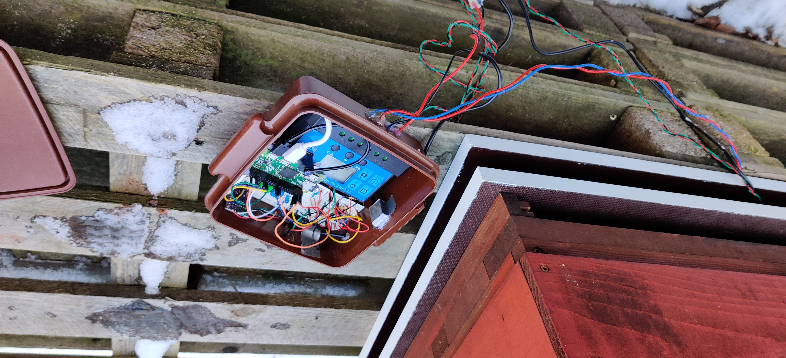
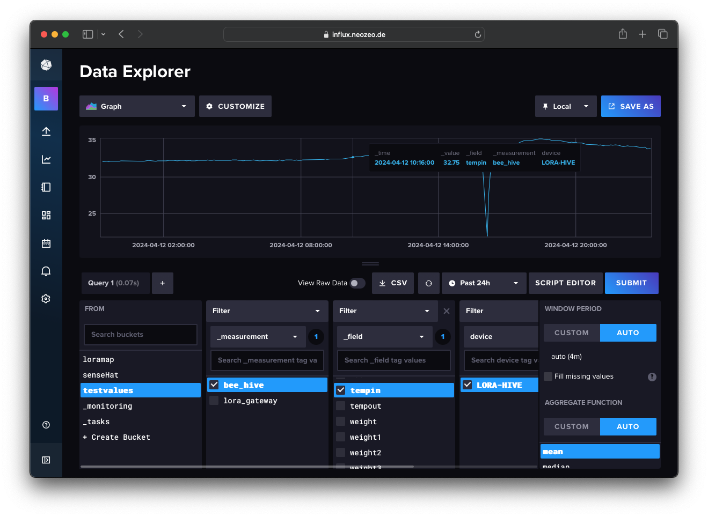

# HiveCom

**This projects aim**: Automatically monitor a beehive to assist a beekeeper in interpreting the bees health and current state in short and long terms. 

**Starting situation**: As I got a lot into electronics and making in the high school, my teacher provided me with the possiblity to do an extra learning project to contribute to my high school diploma 2021. And we do beekeeping as an extracurricular at our high school!

**Why am I doing this**: I really like electronics, understanding systems and using / creating them. While playing around with Raspberry Pis / Arduinos and sensor kits, my head filled with ideas. My grandma was a beekeeper so I always had a good connection to bees. My teacher actually had the idea of monitoring the bees at the school.

**My ambition**: Besides getting into the material myself and trying out different protocols, techniques and parts, I want to have a nice, elegant solution in the end.

**Roadmap**: The project is divided into two parts as I built two mostly completely different systems for monitoring.

**This repository**: Summary / loose documentation of the project to store experiences into.

**Credits**: Many thanks to my kind teacher for supporting me, not only for making this project even possible, but also for the anwering of all kinds of questions regarding beekeeping and funding this project.

Also thanks to the Schülerforschungszentrum Hamburg for supporting / aiding me building and testing the weight scale and the power supply.

# First solution (called Honey Pi) 

The first solution, I built with the help of the [honey-pi.de](honey-pi.de)-tutorial. It is a very nice website from kind people sharing their experiences monitoring their bees with a Raspberry Pi system. Next to the Pi, the main components are a solar panel, car battery, cellular surf-stick for data upload and the weight scale as well as an inside and outside temperature and humidity sensor. The solar panel charges the car battery, the car battery poweres the Raspberry Pi, the Raspberry Pi collects the sensor data and uploads it to the Thingspeak IoT webservice.

### Breadboard setup

(screenshot from the high school diploma documentation)

### IoT box setup

(screenshot from the high school diploma documentation)

### Weight scale setup

(screenshot from the high school diploma documentation)

#### Online service

Thingspeak IoT software solution from Mathworks

Additional own website utilizing Thingspeak API for more beautiful graph display. (Never really used it)

 

## What are the systems components

1. Small car battery, solar panel, charging module
2. Raspberry Pi Zero (not Zero W) mini linux computer, containing prebuilt Python agents for data upload
3. Sensors:
    - 1x DHT22 sensor for temperature & humidity inside the beehive (custom case for bee protection)
    - 1x DHT22 sensor for temperature & humideity outside
    - 1x Bosche H30a weight cell + HX711 weightcell amplifier for continuously weighting the whole beehive
    - 1x voltage divider for checking battery voltage (of around 12V)
4. Uploading via USB-Surfstick with sim card over mobile radio
5. Thingspeak webservice from Mathworks
    1. Stores data for one year for free
    2. Provides nice Rest API for communication between Raspberry Pi & Thingspeak
    3. Modular dashboard vizualization of the data on graphs & widgets
6. Own website that gatheres the data from Thingspeak and displays it in a prettier way

## Experiences

This first solution took around one year to build. I submitted this to my high school exam and got 15/15 points. Yeah!

**Advantages of the system**:
- completely autonomous, if you ignore mobile radio connection strength and choose a free mobile phone contract (yes, there are free ones out there xD)
- beefy power supply & a lot of processing power
- Convenient webservice with easy configuration

**Disadvantages of the system**:
- Linux & so much processing power on an IoT device is overkill (I do not need a lot of data analysis onboard). The IoT device could run on a lot less energy.
- I did not really understand, what those Python scripts really do and I did not trust them
- Shaky beehive position, as it was placed on one small weight cell
- Raspberry Pi always fully on (ca. 150mA at 5V (0.75W)), no sleep function
- Dependancy on ThingSpeak online service with its one year data storage
- It's not really my solution xD

Especially in my implementation:
- Bad connection to sensors because of using breadboards as permanent circuit
- Somehow the system didn't worked really long and I was annoyed and didn't know what to do
- DHT22 sensor inside the beehive was broken as formic acid for bee treatment destroyed it. Also, in beforehand it was always wet because of condensation water in the top of the hive.

**Other experiences building the project**
- Difficulties with high temperature dependancy in weight
- the beefy car battery still ran out

# Second solution (called HiveCom)

After my high school exam, the Honey-Pi solution didn't work properly after a short period of time, and I decided to start a completely new project. I didn't really knew why exactly I spent so much time/energy on it, but somehow I wanted to end this project recently and get it finally working, so now its 2024. I spent a lot of my free time between the study semesters (5th / 6th) of computer science & engineering on this and I am proud that it finally is done! It installed at the hive on April 11th, 2024!

**The live data is actually publicly available here**:
[hivecom.neozeo.de](hivecom.neozeo.de)

In this solution, I did everything by myself:
1. IoT device at the beehive
2. Lora/Wifi Gateway device
3. Self-designed LoRa "protocol"
4. Self-setup docker environment on virtual server with:
    1. Influx data base
    2. Grafana dashboard vizualization

**The system consists of four big parts**:

## 1. IoT node at the beehive

1. Powered by manually rechargable LiPo batteries (2x 2500mAh at 3.7V in parallel)
2. ESP32 as microcontroller for sensor data handling & upload
3. Sensors
    - DHT22 for outside temperature & humidity measurement
    - DS18B20 (watertight) for inside temperature measurement
    - 4x smaler Bosche H10a weight cells plus 4x HX711 weight cell amplifier chips
4. ATtiny84 as second microcontroller for HX711 management
    (The ESP32 has not enough pins to connect all HX711-chips, so I used an Attiny as an IO-middle-man that connects the HX711 chips to the ESP32 as an I2C slave)
5. Periodic data upload over LoRa

For the **schematic**, see "IoT Node Schematic.pdf" file in this repository

Features:
- Maybe half year of battery power supply by using deep sleep mode (I will see)
- Debug mode for checking sensor values directly at the hive
- Changing upload interval via debug mode button (1min, 5min, 20min, 60min, 120min, 360min)
- Easy access to components & see-through case for extra fancyness xD

## 2. LoRa/WiFi gateway

Small device in the school that receives the LoRa Message broadcasted from the IoT node. It is connected to the school WiFi and uploads beehive & maintenance data to my Influx database.

Features:
- Left-button function: See most recent uploaded sensor values
- Middle-button function: View upload log or maybe errors
- Right-button function: RICK ROLL video! (I didn't know what to do with the third button that I've soldered on before I had a plan)

## 3. Self-designed LoRa "Protocol"

LoRa is a nice technology by Semtech that enables long range, low energy data transfer of small payloads. In the maker world, there exist a lot of boards that contain LoRa-chips that are relatively easy to interface with in the Arduino IDE. I chose an ESP32 microcontroller board with a LoRa chip (also battery charging capability). The ESP32 is a powerful chip with versatile features, perfect for IoT-devices. And it is also programmable over USB via the Arduino IDE (or PlatformIO).

However, LoRa does not have a builtin security and you have to broadcast it to everyone. At the Gateway-side, I only want to see the data from my IoT-Node. So I kind of designed my own security solution:

**On the IoT-Node**
1. The IoT-Node under the beehive collects all the data, and then appends it in float-format step by step to a string, comma-separated. This is the payload.
2. The node generates a hash based on the payload string plus password-string appended. The password is stored in the flash memory of both the IoT node and gateway.
3. The node sends the payload plus hash appended over LoRa (using spreading factor 12, standard bandwidth)

**On the Gateway**
If a LoRa package arrives at the gateway:
1. The gateway stores the whole LoRa packet and stores payload and hash separately
3. The gateway also tries to generate the same hash of the packet with its equal password in flash
4. If the hash is equal, I treat the payload as authenticated. If not (or the format/syntax of the package is wrong), I treat it as someone else's package
5. I upload only authenticated values to the Influx data base
6. But I also store the not-authenticated messages separately in the database! (maybe, an alien wants to text me? xD)

### Why not use LoRaWAN?
I also could have chosen to just use the standard LoRaWAN protocol, but then I also would have needed to spend 100 euros or so on an open LoRaWAN gateway. I had two LoRa-capable devices laying around already so I chose using them instead. (But TheThingsNetwork is also a very cool tool too!)

## 4. Web solution

View the live hive data at: [hivecom.neozeo.de](hivecom.neozeo.de)!

Webservice architecture:
- 1-blu.de virtual linux server (Ubuntu 20 LTS) with SSH
- Docker:
    - Portainer for docker management
    - Nginx reverse proxy for subdomain management
    - Influx DB for storing hive data (and maybe trigger webhooks for notifications in the future)
    - Grafana for displaying data from Influx DB

To get this project finally done, I had to do a lot of smaller projects that somehow converged to the final system. I didn't plan these steps, but at the end it somehow came all together.

## Road map side-projects (not in order)

**1. Testing & playing around with Lilygo ESP32 board**

Hehe, I bought this one 2x from Aliexpress. There is near to no documentation to this, just this picture above! But the ESP32 is a pretty standard chip and there is also a pre-made Arduino IDE profile for this board. I like it because it has a lot of interfaces:
- WiFi / Bluetooth (I just use Wifi at the gateway side)
- SD-Card interface
- Small OLED screen (0.92" 128x64 pixel, fun little display!)
- obviously LoRa
- Battery supply and charging circuit! And an on/off switch for the battery. Actually I didn't know whether my LiPo battery cells didn't fit to the battery charging circuit, but I hoped and tried it out and I had luck! Although the circuit gets pretty warm on charging xD

**2.  Think about how to get around with weight calibrating & temperature dependancy**

The project stood still for long time, because I didn't know how I should get around with this problem! 

In the Honey Pi project I experienced a lot of temperature dependence and I was not happy with the stability of the weight scale. 

So for the new solution, I first bought cheap weight cells from Amazon (those cheap sensors you find in weight scales for human). But somehow I didn't know how to use them properly or they are really bad and I was not lucky. (See failed experiment at the bottom on this page)

Then, I bought very expensive weight cells (H10a from Bosche), sum was around 160 euros for just the cells. I really wanted to get every precision I can (even if my teacher said that it should not be needed). By the way, the school's beekeeping money paid it, thank you!

Another problem was, that I didn't know how to calibrate. So if you hook up weight scale to an HX711 amplifier and then the arduino, you first of all get raw values ranging from negative levels to the millions. In theory, you should just build the scale, put nothing on it and take this raw value as a zero value. Then, you put a known weight on it (Higher weights are better for precision) and scale the value you get from the HX711 by the coefficient you get from it. Should be pretty easy, just linear. There are a lot of tutorials for this in the internet.

But there are problems: 
1. I have now 4 weight scales and the old wooden boards are bent over time outside. The weight is distributed not in an equal way on each weight cell.
2. What should I do with temperature dependence? How much do I have to care about it? Is it linear? Quadratic? Logarithmic? And I have no precise temperature sensor!
3. Where the heck do I get a precise, high value weight from to calibrate?

So I spend a few days at the weekend in the Schülerforschungszentrum Hamburg, collecting data the best I could via using ultra precise chemical weight scales with multiple buckets of water. You find the data in the "Bosche Wägezellen H10A Analyse.xlsx" file. I wrote some small python scripts to analyze the values I got through the Serial terminal.

By the way, for every value you want to get from the HX711, you pull 5 values and get the average of it as it is floating a little bit (big problem on the cheap weight cells)

But at the end, I found out that the expensive 4x H10a weight cells had a weight difference of ±20g when I put it in the freezer or lightly blowed on it with a hot air gun. A lot less then I expected and less than the first HoneyPi system that used the single H30a weight!

And then I calibrated the scale with my monitor speakers, which should be 10.4kg (the datasheet says that, I take that as true xD) 

**3. Choosing temperature & humidity sensors**

For the outside I just reused a DHT22 from the old HoneyPi system (seemed to work well). And I thought I just take a watertight temperature sensor for the inside and knock of the humidity sensor for the inside. I used the DS18B20, pretty standard sensors in the maker world backed by good arduino libraries.

**4. Buying more parts**

Yes, you always forget something to buy :/. It is impossible to plan the whole project completely with all costs in advance

**5. Building the weight scale**

So the basic principle of the weight cell is this:

You just measuring the stretching / compressed values.

I also was worried about this scenario:

But I kind of solved the problem a little by having bigger holes at the top board and cutting the screw heads off:

I had a discussion with some friend and my dad on how to get all the weight on all four weight cells without any warping in the wooden boards and parasitic stabilities. Then, I took the Mechanics I module in the university and it actually helped me to understand problem in a better way lol

a. Laser-Cutting the distance parts (between wooden boards and weight cells)
Yay, finally I can use the laser cutter at the Schülerforschungszentrum for good reason! I just drew some simple Fusion 360 sketches for this. And I got a small headache for standing too long next to the machine in the plastic steam xD, but it was fascinating!

THIS IS THE FINAL SCALE!

(I am a little bit worried that the second weight cell bends too much, especially over time it could be a real problem!)

**6. LoRa-Interfacing & developing analysis scripts (Echo, Bluetooth to LoRa terminal)**

Fun part, as you discover functions and unpack a box of new features! I love this

**7. LoRa range limit test at spreading factor 12**

So to get some experience, I put on an echo service on one ESP32 LoRa device. This waits for any package to receive and then sends it back immediately! On the other ESP32, I put on a bluetooth terminal. This way, I could connect my phone to the ESP32, send/receive messages to it in a serial way. The ESP32 then forwards the messages over LoRa and sends me the incoming messages over LoRa. I did this in the weekend with my family at our holiday house in the German heath. Equipped with my phone and the ESP32 Bluetooth/LoRa Terminal, I drove around in a spirally way around the house to test the range of the LoRa technology! It actually was a lot of fun and a weird, but somehow cool feeling to walk around with a weird little hacker device with a power bank and antenna lol.

The maximum range was something around 1.5km with a lot of  trees in between. The lowest range was 700m behind a church.

I also got some experiences working with LoRaWAN spreading factor 12 too in an university project. The signals are very sensitive to weather (rain) and building walls.

At this part, I programmed small logging UIs on the ESP32s OLED screens for extra display and debugging.

**8. Designing the LoRa protocol & testing hardware accelerated hashing**

The ESP32 contains some hardware accelerated encryption system. I previously thought to encrypt the whole payload via RSA but it seemed to be very complicated to calculate with the limited processing resources at the ESP32. Also, I don't care whether someone else also reads the data too. I just want to be sure that the data comes from me, so I put this hash-thing behind the payload.

**9.  Power supply & recharging**

Didn't think a lot about this, I just used not used LiPo batteries laying around in my cupboard. I previously wanted to use them to build a Raspberry Pi Tablet. I was nearly on to finishing the tablet, but I was not happy with battery management there and my soldering skills werent that great in 10th grade or so.

I wanted to include two volume buttons and a single on/off button controlled by an attiny, but had no ideas about core linux drivers so I took it apart again.

**10. ATtiny as additional I2C device & programming ATtiny**

The problem was, that I needed to connect a lot of sensors to the ESP32! And it didn't have enough pins. One solution would be to use multiple analog multiplexers in reverse I think. But I just love Attinys. They are so cool: they are cheap (around 2 euros), very small, need little current, work from multiple voltage supplys and include a lot of interfaces, I think even software emulated ones! And I wanted to try building an I2C slave (I already did this as a university project, but only with one byte data payload) and also need this for my Raspberry Pi tablet in the future maybe.

O, this was a little bit tricky, but I really was interested in getting an own I2C slave working. The ATtiny is also programmed with the arduino bootloader to enable working with standard arduino libraries. To ensure low current draw, I used an ESP32 pin as the power supply for the ATtiny and the HX711 chips. I had a lot of problems getting the I2C connection working as I forgot to turn on the ATtiny power supply on and wait for it to boot lol. But then, trying out with and without pullup resistors, checking the OLED display which is also connected via I2C, it worked like after 8 hours of developing / troubleshooting! 

During troubleshooting, I got a lot of weird display images:

I decided to outsource the weight scale calibration calculations to the ESP32 and let the Attiny just upload the raw values via I2C.

**11. Soldering the circuit & finding a small, some ow "waterproof case"**

Yeah I am not proud of this soldering, but I works. It actually was the easiest part I think. And I had luck not to short anything.

**12.  Getting into the schools enterprise WPA2 Wifi**

As I stil am in close contact with my school teacher who is IT administrator, he gave my Wifi credentials in advance.

I had a lot of respect for this problem as there is little resource out there. I didn't know if I need to switch the whole project to the ESP-IDF development environment because of not having some hardware WiFi driver capabilities.

On standard operating systems, they include a lot of configuration options, but at the microcontroller you have to find them by looking into the wifi driver code!

The arduino wifi library is actually pretty good, but the documentation is not great and I did not got more knowledge from reading the library source code. 

I have ended up trying a lot of different configurations and trying to put a certificate into flash memory. 

I sat in the schools library for like 6 hours and tried and tried and became despair, but the patience was worth it! I got a local dhcp ip address and internet connection and it worked!

**13.  Programming UI on IoT node and gateway**

Yes, took a while but it was not that difficult. It was rather fun to add more and more convenience features and a "booting" animation!

Boot screen (the dots move actually yeah)

**14. Designing a case for the gateway (3D-printed, Fusion 360)**

I was lucky, because I swallowed the price to buy a caliper in advance!

**15.  Getting rick roll video onto gateway device**

Hehe, it was fun to download the video from Youtube in MP4, cut it to like 17 seconds, put it to a lot of BMP images and scaling it down to black / white 128x64 pixel wide. 

There is a nice website out there that puts those pictures to arduino c++ code format. And then you just have to play around with pointers to go trough the pictures.

Maybe I upload a tutorial on how to do this sometime as there is no tutorial just yet

**16.  Approximate battery status from battery voltage**

I used a dual 100kOhm voltage divider for this. Yes, there is a some more current leakage through this, but I think it is ok.

With the help of the graph on Adafruits website (https://learn.adafruit.com/li-ion-and-lipoly-batteries/voltages) I approximated the voltage with two linear functions. I hope, that works as I didn't try it out!

**17. Play around with Arduino InfluxDB library**

O yeah it was nice to see the information flow graph growing at this point

**18. Configure linux server docker environment & configure Nginx to access the services from the internet**

A kind friend of mine helped me get into this very quick, he helped me to set up my server and kind of get basic security in parallel.

**19. Play around with InfluxDB & Grafana**

InfluxDB and Grafana are very nice tools! And it is incredible that they are free! Also, it is fun to link the data together and there is easy satisfaction when combining API keys xD

**20.  Raspberry Pi Home Weather Station Test**

To test the InfluxDB / Grafana software, I hooked up a Raspberry Pi at home with a SenseHat laying around (very nice extension board by the way). I put some small python scripts in systemd I think, so I just upload some sensor data like temperature and humidity from the position under my bed. It actually worked and I forgot it, but then somehow the humidity sensor stopped working. I think, humidity sensors are kind of fragile.

Here I learned how to setup nice Grafana queries and transformations to get nice, colorful graphs!
I think I need to do more with this and try out predicting data based on machine learning?

**21. Configure API keys & database for data upload for Hivecom**

pretty easy at this point

**23. Setup the Grafana dashboard**

It is so satisfying to configure the widgets and graphs and make the data pretty as the whole information flow is complete!

With all kinds of fancy data transformations and filters you can serve the data on the silver platter!

**24.  Test run for a few days & continuosly analyzing**

pretty boring, it just worked lol. 
But I was worried that I approximated the battery in a wrong way, we will see.

**25.  Testing wrong signature LoRa messages**

I obviously need to try to send messages to myself to be able to record someone else's messages after the final deploy! 

**26.  AND THEN FINALLY INSTALLING IT AT THE HIVE!**

April 11th of 2024!

I am very happy that the system is finally in use, but I am still not allowing myself to take too early analyzing steps.

### ToDo
1. Insert images into grafana dashboard to make it more beautiful
2. configure automatical whatsapp notification on hive alarms
3. Documenting the whole f***ing project

# First analysis of the data

Coming soon. But I already see that the humidity sensor shows 99.9% humidity all the time :/, we will see

# Failed experiments

## Using cheap weight cells

I tried using cheap weight cells (ca. 13 euros sum) from Amazon, but the values had a difference of ~130g from the real weight. Also, for every measurement, the values differed from the previous values a lot and I didn't got a clear outcome. I wanted more precise values.

## Designing a custom DHT22 sensor housing for the inside of the hive

I've heard that bees close holes of specific sizes in the beehive to prevent other insects to getting inside the hive. For this, they use their self produced propolis, that is also antibacterial and protects from diseases. Research in the internet did not reveal a specific hole size that gets closed, however it should be between 1-6mm. I designed different cases for the DHT22 to test that out.

However it didn't matter because of the humidity always beeing wet and also broke
¯\\\_(ツ)_/¯

## Getting good temperature-weight-calibration

Probably a little embarrassing, as I tried to measure the temperature-dependancy with a hair dryer in a verrry DIY way. I tried to put one DHT22 directly next to weight scale between the wooden boards, but it worked as well as it looked xD. I put the books around the weight scale to prevent the warm air going fast outside the scale again.

Here is some data I collected in this experiment:

However, sometimes the upload process failed and I didn't know, what to do exactly with this data. Having a low-temperature oven or some 